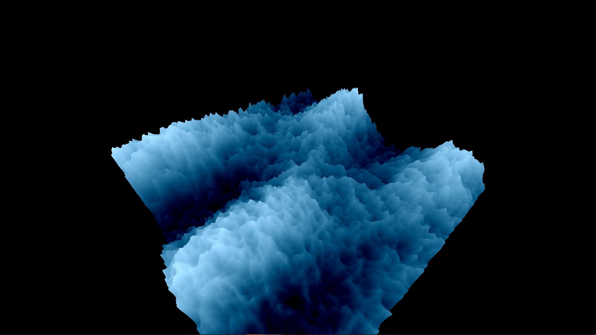
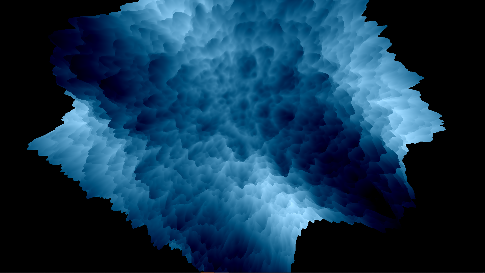

# Raging Sea

A raging sea made and animate with shaders in WebGL.
You can tweak many parameters to create differents shapes.
[live demo](https://raging-sea-alpha.vercel.app)

Exercice from [threejs-journey](https://threejs-journey.xyz/) by [Bruno Simon](https://github.com/brunosimon) to learn [three.js](https://threejs.org/)

### Example

